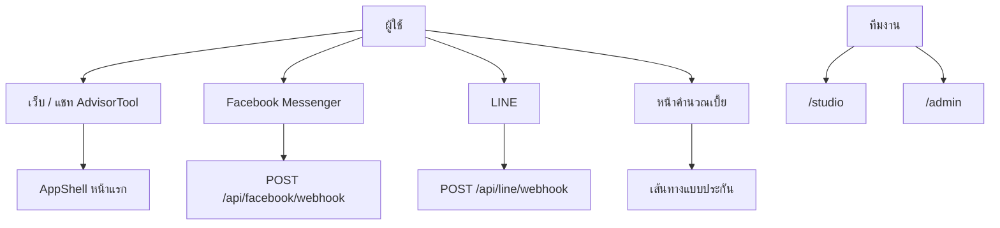
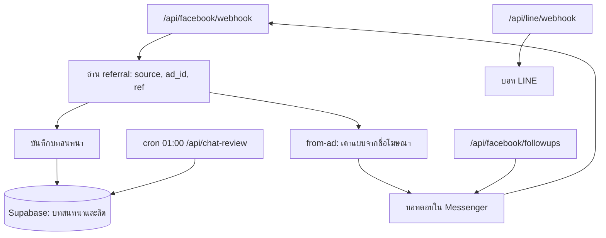
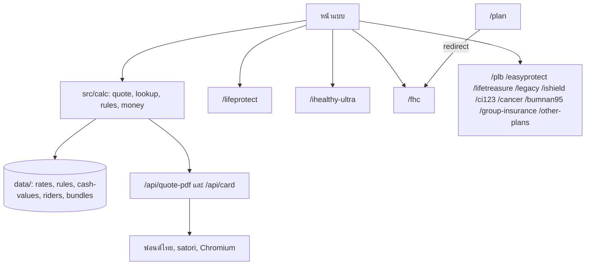
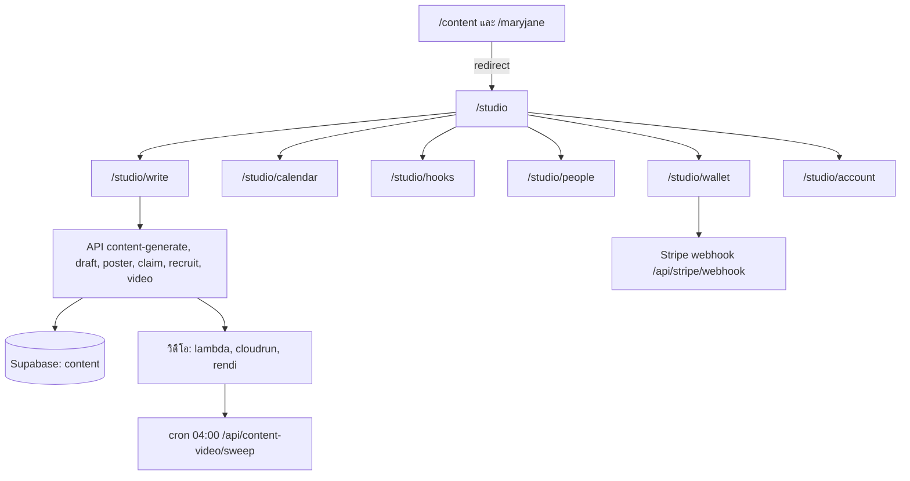
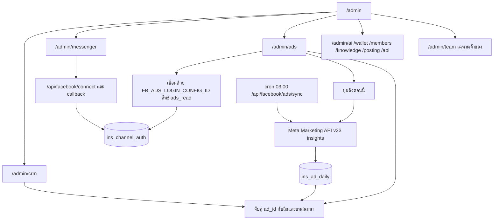
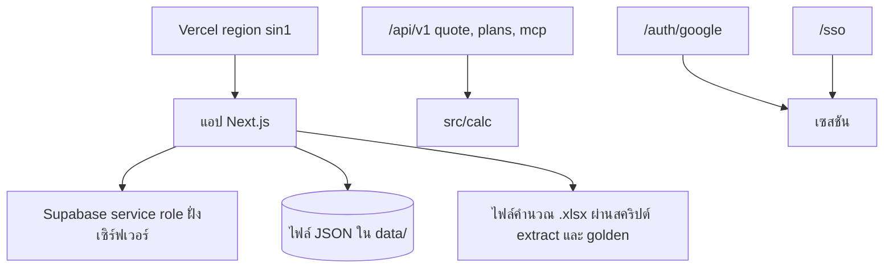

# Workflow ของ insurance-calc (AdvisorTool)

วาดจากโครงสร้างโค้ดที่มีอยู่ ไม่รวมฟีเจอร์ที่ยังไม่มี เช่น Meta Pixel และ Conversions API

## 1. ทางเข้า

## 2. บอทตอบแชท และจับคู่แอด

## 3. เครื่องคำนวณเบี้ย

## 4. สตูดิโอคอนเทนต์

## 5. หลังบ้าน CRM Messenger และโฆษณา

## 6. ข้อมูลและทางเข้าอื่น

